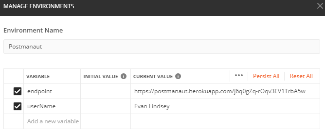

# Postmanaut - WebGL

### Control the Postmanaut in real-time using Postman!

### https://www.evanlindsey.net/Postmanaut


## Instructions

Get the latest version of Postman [HERE](https://www.postman.com/downloads/).

The collection of API calls is available [HERE](https://raw.githubusercontent.com/evanlindsey/Postmanaut/master/Postmanaut.postman_collection.json).

Import the collection in Postman:


Copy the Endpoint URL displayed in the game:


Add the ```endpoint``` and ```userName``` environment variables in Postman:



Send your actions to the Postmanaut:


## Service

- https://github.com/evanlindsey/Postmanaut-Service

## Plugins

- [Unity WebGL SignalR](https://github.com/evanlindsey/Unity-WebGL-SignalR) - Evan Lindsey
- [Unity WebGL Copy and Paste](https://github.com/greggman/unity-webgl-copy-and-paste) - Greggman

## Assets

- [Stylized Astronaut](https://assetstore.unity.com/packages/3d/characters/humanoids/sci-fi/stylized-astronaut-114298) - PULSAR BYTES
- [Animated Planet Bagyo](https://assetstore.unity.com/packages/2d/textures-materials/sky/animated-planet-bagyo-92175) - PULSAR BYTES
- [Aristarchus Region](https://nasa3d.arc.nasa.gov/detail/aristarchus) - NASA
